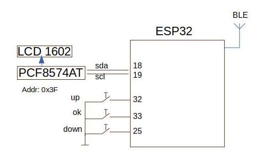

| Supported Target | ESP32 DevkitC v4 | 

# Project name: Leakage protection                                       

# Future:
- В будущем планируется использовать BLE для связи с датчиками протечки.
- Также будет добавлен батарейный модуль для питания устройства при отключении питания, для того чтобы перекрыть подачу воды в квартиру.

## GPIO functions:

| GPIO                         | Direction | Configuration                                          |
| ---------------------------- | --------- | ------------------------------------------------------ |
| CONFIG_OPEN_VALVE            | output    |                                                        |
| CONFIG_CLOSE_VALVE           | output    |                                                        |
| CONFIG_SENSOR1               | input     | pulled up (external), interrupt from falling edge      |
| CONFIG_SENSOR2               | input     | pulled up (external), interrupt from falling edge      |

### Configure the project

### Build and Flash

Build the project and flash it to the board, then run the monitor tool to view the serial output:

Run `idf.py -p PORT flash monitor` to build, flash and monitor the project.

(To exit the serial monitor, type ``Ctrl-]``.)

